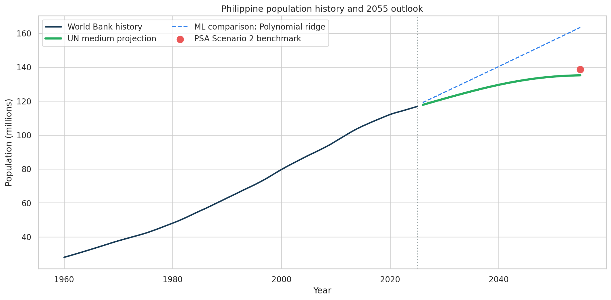
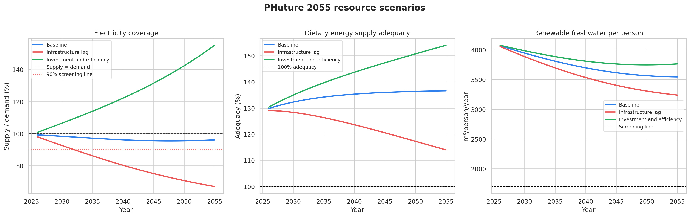
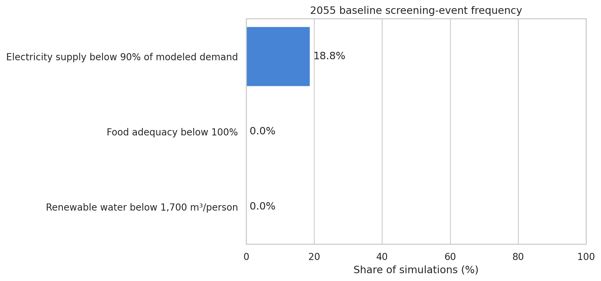

# PHuture 2055

**Can the Philippines sustain its growing population?**

PHuture 2055 is a reproducible machine learning and scenario-analysis project. It studies how Philippine population growth could affect electricity, food and freshwater through 2055.

The project downloads current data from trusted international sources. It cleans and validates the data, backtests several forecasting models and measures when defined resource-pressure thresholds may be crossed.

> This is a portfolio analysis. It is not an official forecast and does not predict a national “collapse year.”

## What the project demonstrates

- Automated collection from APIs and official bulk downloads
- Data cleaning and validation with Pandas
- Time-series backtesting
- Linear regression, polynomial ridge and damped Holt forecasting
- Transparent scenario analysis
- Monte Carlo uncertainty simulation
- Reproducible charts and machine-readable outputs
- Responsible interpretation of long-range predictions

## Research questions

1. What could the Philippine population look like in 2055?
2. How much electricity demand could that population create?
3. Could modeled electricity generation keep pace?
4. Could dietary energy supply adequacy remain above 100%?
5. How could renewable freshwater availability per person change?
6. Which assumptions most strongly affect future resource pressure?

## Data sources

| Source | Data used | Access method |
|---|---|---|
| [UN World Population Prospects 2024](https://population.un.org/wpp/) | Population estimates and medium projection | Compressed CSV bulk download |
| [World Bank Indicators](https://data.worldbank.org/country/philippines) | Population, renewable freshwater, withdrawals and water stress | JSON API |
| [FAOSTAT](https://www.fao.org/faostat/en/) | Dietary energy supply adequacy | Dataset catalog and ZIP bulk download |
| [Our World in Data Energy](https://github.com/owid/energy-data) | Electricity generation and per-capita demand | Versioned CSV |
| [Philippine Statistics Authority](https://psa.gov.ph/statistics/census/projected-population) | 2055 population benchmark | Published projection |
| [Philippine Department of Energy](https://doe.gov.ph/site/epimb/articles/group/statistics?category=Philippine%20Power%20Statistics&display_type=Card) | Official reference for Philippine power statistics | Published statistical tables |

Raw downloads are cached locally and are excluded from Git. Source URLs and retrieval times are written to `outputs/source_manifest.csv`.

## Repository structure

```text
phuture-2055/
├── notebooks/
│   └── phuture_2055.ipynb
├── data/
│   ├── README.md
│   └── raw/                    # Created or populated during execution
├── outputs/
│   ├── forecast_long.csv
│   ├── forecast_summary.json
│   ├── model_validation.csv
│   ├── monte_carlo_risk.csv
│   ├── population_forecast.png
│   ├── resource_scenarios.png
│   ├── risk_probability.png
│   ├── scenario_outlook.csv
│   └── source_manifest.csv
├── scripts/
│   ├── build_notebook.py
│   └── run_notebook.py
├── .gitignore
├── CITATION.cff
├── LICENSE
└── requirements.txt
```

## Quick start

### 1. Create an environment

```bash
python -m venv .venv
```

Activate it on Windows:

```powershell
.venv\Scripts\activate
```

Activate it on macOS or Linux:

```bash
source .venv/bin/activate
```

### 2. Install the dependencies

```bash
python -m pip install -r requirements.txt
```

### 3. Open the notebook

```bash
jupyter lab notebooks/phuture_2055.ipynb
```

Run all cells from top to bottom. The first run downloads the source datasets. Later runs reuse the local cache.

You can also execute the full notebook from the command line:

```bash
python scripts/run_notebook.py
```

## Validated output snapshot

The included notebook was executed on August 17, 2026. The scenario engine uses the UN World Population Prospects 2024 medium variant. It reaches **135.14 million people in 2055**. The PSA Scenario 2 benchmark is **138.67 million**.

| Scenario | Electricity coverage in 2055 | First year below 90% | Food adequacy in 2055 | Renewable water in 2055 |
|---|---:|---:|---:|---:|
| Baseline | 96.1% | After 2055 | 136.6% | 3,544 m³/person |
| Infrastructure lag | 67.0% | 2032 | 114.0% | 3,239 m³/person |
| Investment and efficiency | 155.1% | After 2055 | 153.9% | 3,763 m³/person |

These values depend on the visible assumptions in the notebook. They are scenario results, not promises about the future.







## Scenarios

| Scenario | Description |
|---|---|
| Baseline | The selected forecasting trends continue |
| Infrastructure lag | Supply investment slows while demand and climate pressure rise |
| Investment and efficiency | Capacity, productivity, conservation and efficiency improve |

The annual adjustments are visible in the `SCENARIOS` dictionary inside the notebook. They can be changed and rerun.

## Screening thresholds

| Indicator | Screening condition | Meaning |
|---|---|---|
| Electricity | Modeled supply is below 90% of modeled annual demand | Material annual generation pressure under the stated scenario |
| Food | Dietary energy supply adequacy is below 100% | Aggregate dietary energy supply is below estimated requirements |
| Water | Renewable water is below 1,700 m³ per person per year | National water-pressure screening signal |

These thresholds do not describe local access or grid reliability. See the limitations section in the notebook.

## Rebuild the notebook

The committed notebook is generated from maintainable source cells:

```bash
python scripts/build_notebook.py
```

After rebuilding, execute it again to refresh the embedded outputs.

## Responsible use

Long-range forecasts are sensitive to fertility, migration, climate, imports, technology and policy. National averages can hide local shortages and inequality. Use this project to compare scenarios and identify questions for deeper research. Do not use it as the sole basis for public policy or investment decisions.

## Author

Luke Mark P. Leona

## License

The project code is available under the [MIT License](LICENSE). Data remains subject to the terms of each publisher.
